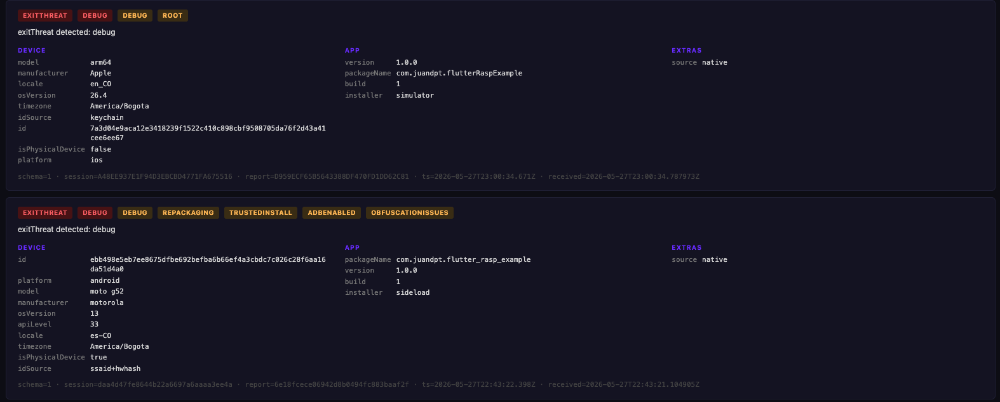

# Flutter RASP

[](https://pub.dev/packages/flutter_rasp)
[](https://opensource.org/licenses/MIT)
[](https://flutter.dev)

RASP (Runtime Application Self-Protection) for Flutter. Detects
runtime tampering and ships every event to your own backend.

## Features

- Threat detection (16 threats including root/jailbreak, hooks,
  debugger, repackaging, untrusted install, emulator, VPN…).
- Real-time monitoring with native-level termination when a
  configured threat fires.
- Screen capture protection.
- SSL certificate pinning (plain `.pem`, encrypted `.enc`, or a
  remote certificate downloaded from your endpoint and kept in
  secure storage).
- Built-in security reporter — every detected threat and policy-
  triggered exit shipped to your HTTPS endpoint with HMAC + optional
  pinning. Flutter/Dart error capture is available but **off by
  default** (opt in via `captureFlutterErrors` / `capturePlatformErrors`).

| Platform | Minimum |
| -------- | ------- |
| Android  | API 24  |
| iOS      | 13.0    |

```yaml
dependencies:
  flutter_rasp: ^7.1.0
```

---

## Threat detection

| Threat                 | Android | iOS |
| ---------------------- | :-----: | :-: |
| Root / Jailbreak       |   ✅    | ✅  |
| Emulator / Simulator   |   ✅    | ✅  |
| Debugger               |   ✅    | ✅  |
| Hooks (Frida / Xposed) |   ✅    | ✅  |
| Repackaging            |   ✅    | ✅  |
| Trusted install        |   ✅    | ✅  |
| VPN                    |   ✅    | ✅  |
| Device passcode        |   ✅    | ✅  |
| Secure hardware        |   ✅    | ✅  |
| Device binding         |   ✅    | ✅  |
| Screen capture block   |   ✅    | ✅  |
| Developer mode         |   ✅    |  —  |
| ADB enabled            |   ✅    |  —  |
| Obfuscation            |   ✅    |  —  |
| Time spoofing          |   ✅    |  —  |
| Location spoofing      |   ✅    |  —  |
| Multi-instance         |   ✅    |  —  |

**Device binding** (`Threat.deviceBinding`) fires when the app is running
with data that belongs to a different device (backup restore, device
transfer, or data cloning). Respond by re-authenticating the user rather
than terminating the app — migrating to a new phone is a legitimate flow,
so it is intentionally excluded from every `ThreatPolicy` preset.

> **Note (Android):** device binding works with the app's default backup
> configuration. If your app customizes it — `android:allowBackup="false"`
> or restrictive `dataExtractionRules` — this threat may not be reported.

### Initialize

Recommended order: **set up SSL pinning first**, then initialize
RASP (and, optionally, the reporter). Doing pinning first resolves
and caches the certificate, so the reporter can reuse it through
`pinnedCertPem` — no second fetch, no duplicated cert handling.

```dart
Future<void> main() async {
  WidgetsFlutterBinding.ensureInitialized();

  // 1. SSL pinning first.
  const pinningConfig = SslPinningConfig(
    certificateAssetPaths: ['assets/certs/api.pem'],
  );
  await SslPinningClient.createContext(pinningConfig);

  // 2. RASP monitoring (+ optional reporter).
  await FlutterRasp.instance.initialize(
    config: const RaspConfig(
      policy: ThreatPolicy.high,
      monitoringInterval: Duration(seconds: 10),
      androidConfig: AndroidRaspConfig(
        signingCertHashes: ['<sha256-from-Play-Console>'],
      ),
      iosConfig: IosRaspConfig(
        teamId: '<APPLE-TEAM-ID>',
        bundleIds: ['com.your.bundle'],
      ),
    ),
    onThreatDetected: (threats) => debugPrint('$threats'),
    // Optional — ship reports to your backend.
    reporter: ReporterConfig(
      endpoint: Uri.parse('https://your-backend.example.com/v1/ingest'),
      // Optional — pin the reporter's internal HTTP client too.
      // Omit it to fall back to system TLS validation (no pinning).
      pinnedCertPem: SslPinningClient.cachedPem(pinningConfig),
    ),
  );

  runApp(const MyApp());
}
```

> Provide at least one of `onThreatDetected` or `threatCallback`.
> The `reporter` argument is optional — omit it if you don't need
> backend reporting. Pinning the reporter's HTTP client is **also
> optional**: pass `pinnedCertPem` to pin it, or leave it `null` for
> system TLS validation. Flutter/Dart error capture is **off by
> default**; see [Security reporter](#security-reporter).

**`signingCertHashes`** is the SHA-256 of the **Play signing key**
(Play Console → App integrity → App signing). **`teamId`** is on
[developer.apple.com](https://developer.apple.com/account) →
Membership Details.

### Threat policies

| Policy                | Terminates on                                                         |
| --------------------- | --------------------------------------------------------------------- |
| `ThreatPolicy.none`   | nothing (report-only)                                                 |
| `ThreatPolicy.low`    | repackaging                                                           |
| `ThreatPolicy.medium` | + root, hook, obfuscationIssues, multiInstance                        |
| `ThreatPolicy.high`   | + debug, devicePasscode, secureHardware, adbEnabled, locationSpoofing |

Or roll your own:

```dart
const policy = ThreatPolicy(exitThreats: {Threat.root, Threat.vpn});
```

### On-demand scan

```dart
final result = await FlutterRasp.instance.scanAll();
if (result.isCompromised) print(result.detectedThreats);
```

Or per-threat: `isRooted()`, `isEmulator()`, `isHooked()`,
`isVpnConnected()`, etc. — one method per `Threat` value.

### Screen capture protection

```dart
await FlutterRasp.instance.blockScreenCapture(true);
```

---

## SSL certificate pinning

**1. Local certificate** (recommended) — bundled asset, plain or
encrypted (encrypt with the
[Certificate Encryptor](tool/certificate_encryptor/) web tool):

```dart
const config = SslPinningConfig(
  certificateAssetPaths: ['assets/certs/api.enc'],
  passphrase: 'your_passphrase', // omit for plain .pem
);
final client = await SslPinningClient.createHttpClient(config);
```

Works with `dart:io`, Dio (`IOHttpClientAdapter`), `package:http`
(`IOClient`).

**2. Download a remote certificate** — plain or encrypted, depending
on the file and `passphrase`. The download **always replaces** the
stored copy; if it fails, the copy from a previous session is
restored, so one call at startup is enough:

```dart
final remoteConfig = RemoteCertificateConfig(
  url: Uri.parse('https://your-cdn.example.com/api.enc'),
  passphrase: 'your_passphrase', // omit for plain PEM
);
await SslPinningClient.downloadCertificate(remoteConfig);
```

**3. Use the downloaded certificate** — synchronous, no network:

```dart
final client = SslPinningClient.createRemoteHttpClient(remoteConfig);
```

`cachedPem(config)` / `cachedRemotePem(remoteConfig)` return the
resolved PEM after initialization — forward to the reporter's
`pinnedCertPem` to reuse the same cert.

---

## Security reporter

Pass a `ReporterConfig` to `FlutterRasp.initialize(...)` and the
plugin ships every detected threat and policy-triggered exit to
your backend.

> **Flutter/Dart errors are not captured by default.** In
> development they can be extremely noisy, so `captureFlutterErrors`
> and `capturePlatformErrors` both default to `false`. Set them to
> `true` when you want framework / uncaught Dart errors shipped too.

```dart
await FlutterRasp.instance.initialize(
  config: const RaspConfig(policy: ThreatPolicy.high, /* ... */),
  onThreatDetected: (threats) => debugPrint('$threats'),
  reporter: ReporterConfig(
    endpoint: Uri.parse('https://your-backend.example.com/v1/ingest'),
    headers: const {'X-Project-Id': 'my-app'},
    hmacKey: const String.fromEnvironment('RASP_HMAC_KEY'),
    pinnedCertPem: SslPinningClient.cachedPem(pinningConfig), // optional
  ),
);
```

### Configuration

| Field                    | Default            | Purpose                                                          |
| ------------------------ | ------------------ | ---------------------------------------------------------------- |
| `captureFlutterErrors`   | `false`            | Hook `FlutterError.onError`. Disabled by default — opt in.       |
| `capturePlatformErrors`  | `false`            | Hook `PlatformDispatcher.onError`. Disabled by default — opt in. |
| `captureExitThreats`     | `true`             | Ship a report synchronously before RASP kills the process.       |
| `captureDetectedThreats` | `true`             | Auto-ship when a new threat is observed (deduped per session).   |
| `maxBreadcrumbs`         | `50`               | FIFO cap.                                                        |
| `maxPendingReports`      | `50`               | On-disk queue cap.                                               |
| `exitTimeout`            | `1.5 s`            | Max wait for the exit report before termination.                 |
| `httpTimeout`            | `1.2 s`            | Per-attempt timeout.                                             |
| `retryBackoffs`          | `[3 s, 9 s, 27 s]` | Backoff schedule.                                                |
| `userId`                 | `null`             | Optional `user.id`.                                              |

### Wire format

```json
{
  "schemaVersion": 1,
  "reportId": "<uuid-hex>",
  "timestamp": "2026-05-27T10:30:00.000Z",
  "sessionId": "<uuid-hex>",
  "event": "enforcedExit",
  "crashThreat": "root",
  "detectedThreats": ["root", "hook"],
  "message": "enforcedExit triggered by: root",
  "breadcrumbs": [
    {
      "ts": "...",
      "category": "rasp",
      "level": "warning",
      "message": "threats detected"
    }
  ],
  "device": {
    "id": "<sha256-hex>",
    "platform": "android",
    "model": "Pixel 7",
    "manufacturer": "Google",
    "osVersion": "14",
    "apiLevel": 34,
    "locale": "es-ES",
    "country": "CO",
    "timezone": "America/Bogota",
    "isPhysicalDevice": true
  },
  "app": {
    "packageName": "com.example.app",
    "version": "1.2.3",
    "build": "456",
    "installer": "com.android.vending",
    "firstInstallMs": 1747000000000,
    "lastUpdateMs": 1747500000000,
    "buildType": "release",
    "abi": "arm64-v8a"
  },
  "network": {
    "type": "wifi",
    "carrier": "Claro",
    "mcc": "732",
    "mnc": "101"
  },
  "policy": { "exitThreats": ["root", "hook", "repackaging"] },
  "user": { "id": "<optional>" },
  "extras": { "source": "native" }
}
```

| Field                | Description                                                                                                                                        |
| -------------------- | -------------------------------------------------------------------------------------------------------------------------------------------------- |
| `event`              | `threatsDetected` · `enforcedExit` · `flutterError` · `dartError` · `manualCapture`.                                                               |
| `crashThreat`        | Set only on `enforcedExit` — the threat that triggered termination.                                                                                |
| `detectedThreats`    | All threats observed in this event.                                                                                                                |
| `policy.exitThreats` | The exact list the integrator configured as `exitThreats`.                                                                                         |
| `app.installer`      | Android: package name (Play, Amazon…) or `sideload`. iOS: `appStore` / `testFlight` / `simulator` / `dev` / `enterprise` / `sideload` / `unknown`. |
| `network.type`       | `wifi` / `cellular` / `ethernet` / `vpn` / `none` / `unknown`. Carrier + MCC/MNC on Android with a SIM.                                            |
| `extras.source`      | `enforcedExit` ships `"native"` (built and shipped from the native exit path).                                                                     |

When `hmacKey` is set, every body is signed with `HMAC-SHA256`
and forwarded as the `X-Rasp-Signature` header.

### Reliability

- Pending reports are persisted encrypted at rest. If delivery
  fails or the process dies, the report ships on next launch.
- `enforcedExit` reports are shipped synchronously before the
  process is killed, on a bounded time budget you control with
  `exitTimeout`.
- `4xx` → permanent rejection (dropped). `5xx` / network errors →
  retried with backoff.

### What we don't collect

Source IP (your backend already has it), precise location,
advertising id, IMEI, MAC, SIM serial.

### Try it locally

The `example/` app bundles a Dart mock backend that renders every
report it receives. See [`example/README.md`](example/README.md)
for the three-step setup.



---

## Architecture

```
Flutter App
    ▼
Dart (public API): FlutterRasp · RaspReporter · SslPinning
    ▼  Pigeon (typed bridge)
flutter_rasp plugin (Kotlin / Swift)
    ▼  in-process
flutter_rasp_core (precompiled AAR / XCFramework)
  detectors · reporter · screen capture
```

Detectors and the reporter ship compiled and obfuscated. The Dart
layer is intentionally thin.

---

## License

MIT. See [LICENSE](LICENSE).
